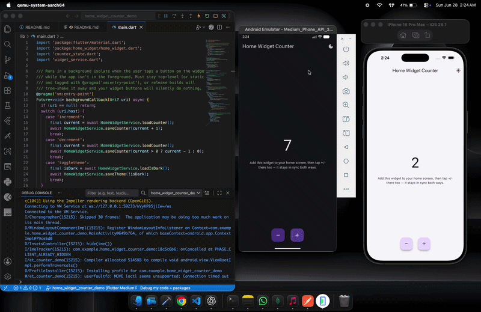

# 🏠 Home Widget Counter Demo

A Flutter app demonstrating **bidirectional sync** between a Flutter app and native home screen widgets on both **Android** and **iOS** — using the [`home_widget`](https://pub.dev/packages/home_widget) plugin.

Tap +/− in the app → widget updates instantly.  
Tap +/− on the widget → open the app → app reflects the change.  
Theme toggle (dark/light) syncs both ways too.

---

## 📱 Demo

<p align="center">
  
</p>
---

## ✨ Features

- ➕ Increment / ➖ Decrement counter from both app and widget
- 🌙 Dark / Light theme toggle synced between app and widget
- 🔄 Bidirectional sync via shared storage (SharedPreferences on Android, App Groups UserDefaults on iOS)
- 📦 Clean architecture: `CounterState`, `HomeWidgetService`, `WidgetKeys`

---

## 🗂 Project Structure

```
lib/
├── main.dart              # Entry point, background callback registration
├── counter_state.dart     # ChangeNotifier state (count + theme)
└── widget_service.dart    # home_widget read/write/refresh helpers

android/app/src/main/
├── kotlin/.../CounterWidgetProvider.kt   # Android widget provider
├── res/layout/counter_widget.xml         # Android widget layout
├── res/xml/counter_widget_info.xml       # Android widget metadata
└── res/drawable/                         # ic_plus_circle, ic_minus_circle, ic_theme_toggle

ios/CounterWidgetExtension/
├── CounterWidgetExtension.swift          # iOS widget (entry, provider, intents, view)
└── CounterWidgetExtensionBundle.swift    # iOS widget bundle entry point
```

---

## 🚀 Getting Started

### Prerequisites

- Flutter 3.x
- Xcode 15+ (for iOS)
- Android Studio / VS Code
- A physical device or simulator (widgets don't work in all simulators)

### Install dependencies

```bash
flutter pub get
```

---

## 🤖 Android Setup

### 1. Add `home_widget` to `pubspec.yaml`

```yaml
dependencies:
  home_widget: ^0.5.0
```

### 2. Register the widget provider in `AndroidManifest.xml`

```xml
<receiver android:name=".CounterWidgetProvider" android:exported="true">
    <intent-filter>
        <action android:name="android.appwidget.action.APPWIDGET_UPDATE" />
    </intent-filter>
    <meta-data
        android:name="android.appwidget.provider"
        android:resource="@xml/counter_widget_info" />
</receiver>

<!-- Required for background interactivity callbacks -->
<receiver android:name="es.antonborri.home_widget.HomeWidgetBackgroundReceiver" android:exported="true" />
<service android:name="es.antonborri.home_widget.HomeWidgetBackgroundService"
    android:permission="android.permission.BIND_JOB_SERVICE"
    android:exported="true" />
```

### 3. Widget layout (`res/layout/counter_widget.xml`)

Standard `LinearLayout` with:
- `TextView` for label and counter value
- `ImageView` for decrement, increment, theme toggle buttons

### 4. Widget provider (`CounterWidgetProvider.kt`)

Extends `HomeWidgetProvider`. In `onUpdate`:
- Reads `counter_value` and `is_dark_mode` from `SharedPreferences`
- Sets text, colors dynamically
- Attaches `HomeWidgetBackgroundIntent` pending intents to each button

### 5. Drawables

Add vector drawables to `res/drawable/`:
- `ic_plus_circle.xml`
- `ic_minus_circle.xml`
- `ic_theme_toggle.xml`

### How Android interactivity works

```
Widget button tap
    → HomeWidgetBackgroundIntent broadcast (URI: counterdemo://increment)
    → backgroundCallback() in main.dart (background isolate)
    → HomeWidgetService.saveCounter()
    → HomeWidget.updateWidget() → CounterWidgetProvider.onUpdate()
    → Widget re-renders with new value
```

---

## 🍎 iOS Setup

### 1. Add App Group capability

In Xcode → Runner target → **Signing & Capabilities** → **+ App Groups**  
Add: `group.com.example.homewidgetcounterdemo`

Do the same for the widget extension target.

### 2. Add Widget Extension target

In Xcode → File → New → Target → **Widget Extension**  
Name it (e.g. `CounterWidgetExtension`)  
Uncheck "Include Configuration Intent"

### 3. Update `Podfile`

```ruby
platform :ios, '17.0'

target 'Runner' do
  use_frameworks!
  use_modular_headers!
  flutter_install_all_ios_pods File.dirname(File.realpath(__FILE__))
end

target 'CounterWidgetExtensionExtension' do
  use_frameworks!
  use_modular_headers!
  pod 'home_widget', :path => '.symlinks/plugins/home_widget/ios'
end

post_install do |installer|
  installer.pods_project.targets.each do |target|
    flutter_additional_ios_build_settings(target)
    target.build_configurations.each do |config|
      config.build_settings['IPHONEOS_DEPLOYMENT_TARGET'] = '17.0'
    end
  end
end
```

Then run:
```bash
cd ios && pod install
```

### 4. Add `AppIntents.framework`

In Xcode → select your widget extension target → **General** → **Frameworks and Libraries** → click `+` → search `AppIntents` → Add → set to **Do Not Embed**

### 5. Fix `CLANG_WARN_QUOTED_INCLUDE_IN_FRAMEWORK_HEADER`

In Xcode → widget extension target → **Build Settings** → search `CLANG_WARN_QUOTED_INCLUDE_IN_FRAMEWORK_HEADER` → set all configs to `$(inherited)`

### 6. Widget code (`CounterWidgetExtension.swift`)

Single file containing:
- `IncrementIntent`, `DecrementIntent`, `ToggleThemeIntent` (`@available(iOS 17.0, *)`)
- `SimpleEntry: TimelineEntry` with `count` and `isDark`
- `Provider: TimelineProvider` reading from `UserDefaults(suiteName:)`
- `CounterWidgetExtensionEntryView` with `Button(intent:)` for each action
- `CounterWidgetExtension: Widget` struct

### How iOS interactivity works

```
Widget button tap
    → AppIntent.perform() runs natively (no Flutter needed)
    → Writes directly to UserDefaults(suiteName: appGroupId)
    → WidgetCenter.shared.reloadAllTimelines()
    → Widget re-renders with new value

App opens / resumes
    → didChangeAppLifecycleState(.resumed)
    → CounterState.syncFromWidget()
    → Reads latest value from home_widget (same UserDefaults under the hood)
    → UI updates
```

---

## 🔄 Bidirectional Sync Architecture

```
┌─────────────────────────────────────────────────────┐
│                  Shared Storage                     │
│  Android: SharedPreferences                         │
│  iOS:     UserDefaults (App Group suite)            │
│                                                     │
│  Keys: counter_value, is_dark_mode, last_updated    │
└──────────────┬──────────────────┬───────────────────┘
               │                  │
    ┌──────────▼──────┐  ┌────────▼──────────┐
    │   Flutter App   │  │  Native Widget    │
    │                 │  │                   │
    │ HomeWidgetService│  │ Android: Provider │
    │ saveCounter()   │  │ iOS: AppIntent    │
    │ loadCounter()   │  │                   │
    │ syncFromWidget()│  │ Reads storage on  │
    │                 │  │ every render      │
    └─────────────────┘  └───────────────────┘
```

---

## 🧩 Key Files Explained

### `lib/widget_service.dart`
Central place for all `home_widget` calls. Keys are defined as constants — any mismatch between Flutter and native silently breaks sync.

### `lib/counter_state.dart`
`ChangeNotifier` holding `count` and `isDark`. All mutations save to widget storage and trigger a widget refresh.

### `lib/main.dart`
Registers `backgroundCallback` — the top-level function called by Android's `HomeWidgetBackgroundIntent`. Must be annotated with `@pragma('vm:entry-point')`.

On iOS this callback is not invoked (intents run natively), but registering it does no harm.

---

## ⚠️ Common Pitfalls

| Issue | Fix |
|-------|-----|
| Widget shows placeholder grey buttons on iOS | `AppIntents.framework` not linked to widget extension target |
| Counter not syncing app → widget on iOS | Check `iOSName` in `HomeWidget.updateWidget()` matches the `kind` string in your Widget struct |
| Widget shows stale data after app changes | Make sure `_refresh()` is called after every save |
| iOS build fails with "module has minimum deployment target" | Set `IPHONEOS_DEPLOYMENT_TARGET = 17.0` in both Podfile and Xcode project settings |
| `Invalid redeclaration` Swift errors | You have duplicate type definitions across multiple Swift files — keep everything in one file |
| Android widget buttons do nothing | Missing `HomeWidgetBackgroundReceiver` / `HomeWidgetBackgroundService` in `AndroidManifest.xml` |
| App Group ID mismatch | Must be identical in: Flutter (`setAppGroupId`), iOS entitlements, and Swift code |

---

## 📦 Dependencies

```yaml
dependencies:
  flutter:
    sdk: flutter
  home_widget: ^0.5.0
```

---

## 📄 License

MIT
